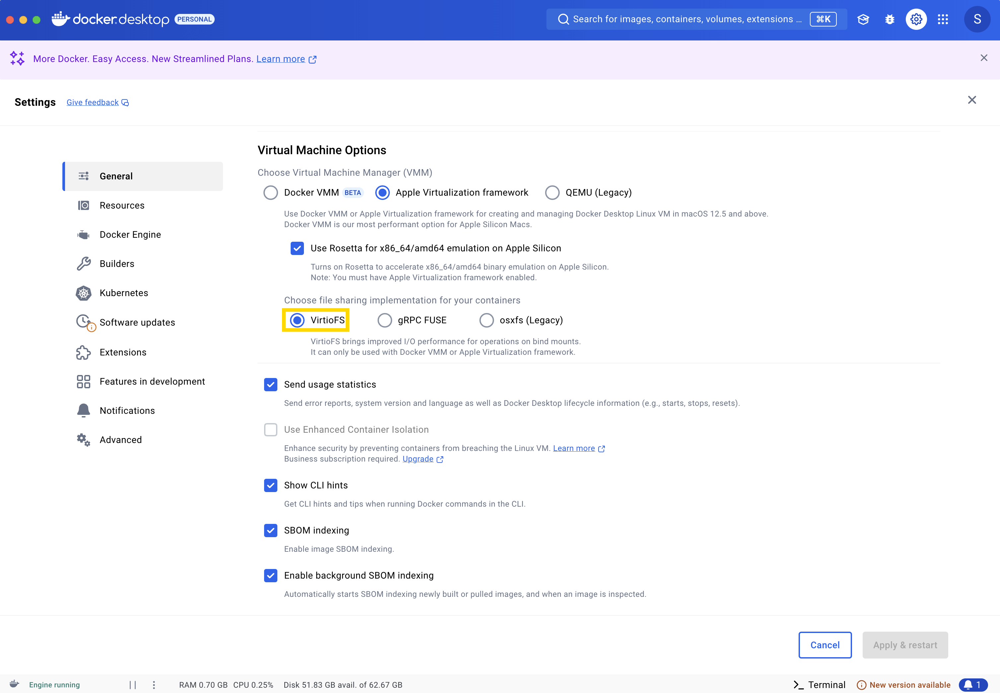
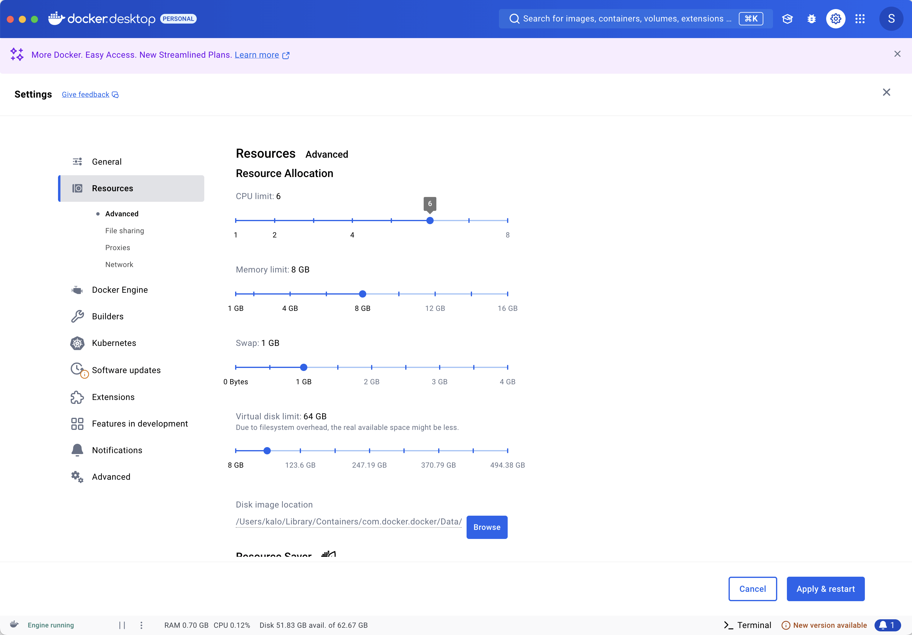

<div align="center">

[](https://github.com/hashgraph/hedera-local-node/actions/workflows/flow-pull-request-checks.yaml)[](https://www.npmjs.com/package/@hashgraph/hedera-local)
[](docs/environment-variables.md)
[](https://github.com/hashgraph/hederajson-rpc-relay/)
[](LICENSE)

</div>
The Hedera Local Node project allows developers to set up their own local network. The local network is composed of one mirror node and one consensus node. You can set this up by either using the CLI tool or by running Docker.
</br></br>

> **_NOTE:_**  It's recomended to start using the CLI Tool.

- [Docker](#docker)
- [CLI Tool](#cli-tool)
- [Environment Variables](./docs/environment-variables.md)
- [Grafana & Prometheus](#grafana--prometheus)

# Requirements

- [Node.js](https://nodejs.org/) `>= v14.x`
  - Node version check: `node -v`
- NPM `>= v6.14.17`
  - NPM version check: `npm -v`
- [Docker](https://www.docker.com/) `>= v20.10.x`
  - Docker version check: `docker -v`
- [Docker Compose](https://docs.docker.com/compose/) `=> v2.12.2`
  - Docker Compose version check: `docker compose version`
- Minimum 16GB RAM

### Note:

- **Ensure the `VirtioFS` file sharing implementation is enabled in the docker settings.**

Note: The image may look different if you are on a different version


- Ensure the following configurations are set at minimum in Docker **Settings** -> **Resources** and are available for use
  - **CPUs:** 6
  - **Memory:** 8GB
  - **Swap:** 1 GB
  - **Disk Image Size:** 64 GB

Note: The image may look different if you are on a different version


# CLI Tool - @hashgraph/hedera-local

## What

This package defines cli commands, that can be executed via node (npx), for interacting with the Local Hedera
Network.

## Installation

#### Official NPM Release

The command below can be used to install the official release from the NPM repository. This version may not reflect
the most recent changes to the `main` branch of this repository.

This version uses a baked in version of the Docker Compose definitions and will not reflect any local changes made to
the repository.

```bash
npm install @hashgraph/hedera-local -g
```

#### Local Development Installation

The command below can be used to install the `hedera-local` module as a symlink against your locally checked out copy of
this repository.

This is the recommended method for testing against the latest changes or a point in time version from a branch/tag.

```bash
npm install && npm install -g
```

## Using npm

`npm run start` to start the network
`npm run restart` to restart the network
`npm run stop` to stop the network
`npm run generate-accounts` to generate new account for already started network

> **_NOTE:_**  If you want to use any of the CLI options listed below, you'd need to pass `--` after `npm run start` (for example) and then specify the wanted option. For example, if you want to start in detached mode, you can use `npm run start -- -d`


## Using hedera-local

```
$ hedera

Local Hedera Package - Runs consensus and mirror nodes on localhost:
- consensus node url - 127.0.0.1:50211
- node id - 0.0.3
- mirror node url - http://127.0.0.1:5551

Available commands:
    start - Starts the local hedera network.
        options:
            --d or --detached for starting in detached mode.
            --verbose set the verbose level. Defaults to 'info' choices are "info" & "trace"
            --h or --host to override the default host.
            --n or --network to override the default configuration. Defaults to mainnet.
            --l or --limits to enable/disable the JSON-RPC relay rate limits. Defaults to true.
            --dev to enable/disable developer mode.
            --full to enable/disable full mode. Production local-node.
            --balance to set starting hbar balance of the created accounts.
            --async to enable or disable asynchronous creation of accounts.
            --b or --blocklist to enable or disable account blocklisting. Depending on how many private keys are blocklisted, this will affect the generated on startup accounts.
            --enable-debug  Enable or disable debugging of the local node [boolean] [default: false]
            --workdir       Path to the working directory for local node [string] [default: "[USER APP DATA]/hedera-local"]
    stop - Stops the local hedera network and delete all the existing data.
    restart - Restart the local hedera network.
    generate-accounts <n> - Generates N accounts, default 10.
        options:
            --h or --host to override the default host.
            --balance to set starting hbar balance of the created accounts.
            --async to enable or disable asynchronous creation of accounts.
    debug [timestamp] - Parses and prints the contents of the record file that has been created
                        during the selected timestamp.
                        Important: Local node must be started with the -g, --enable-debug flag to enable this feature
```

Note: Generated accounts are 3 types (ECDSA, Alias ECDSA and ED25519). All of them are usable via HederaSDK. Only Alias ECDSA accounts can be imported into wallet like Metamask or used in ethers.

Note: Read more about `developer mode` [here](https://github.com/hashgraph/hedera-json-rpc-relay/blob/main/docs/dev-mode.md)

### Commands

#### `hedera start <options>`


- --accounts - Default is 10. Specify the number of accounts to generate at startup. The first 10 are with predefined
  private keys, and the next ones are with random generated private keys.

- --h / --host - Override the default host.

#### `hedera restart <options>`


- --accounts - Default is 10. Specify the number of accounts to generate at startup. The first 10 are with predefined
  private keys, and the next ones are with random generated private keys.

- --h / --host - Override the default host.

#### `hedera start -d <options>`

```bash
$ hedera start
[Hedera-Local-Node] INFO (StateController) Starting start procedure!
[Hedera-Local-Node] INFO (InitState) Making sure that Docker is started and it's correct version...
[Hedera-Local-Node] INFO (InitState) Setting configuration for local network with latest images on host 127.0.0.1 with dev mode turned off using turbo mode in single node configuration...
[Hedera-Local-Node] INFO (InitState) Hedera JSON-RPC Relay rate limits were disabled.
[Hedera-Local-Node] INFO (InitState) Needed environment variables were set for this configuration.
[Hedera-Local-Node] INFO (InitState) Needed bootsrap properties were set for this configuration.
[Hedera-Local-Node] INFO (InitState) Needed mirror node properties were set for this configuration.
[Hedera-Local-Node] INFO (StartState) Starting Hedera Local Node...
[Hedera-Local-Node] INFO (StartState) Detecting network...
[Hedera-Local-Node] INFO (StartState) Hedera Local Node successfully started!
[Hedera-Local-Node] INFO (NetworkPrepState) Starting Network Preparation State...
[Hedera-Local-Node] INFO (NetworkPrepState) Imported fees successfully
[Hedera-Local-Node] INFO (NetworkPrepState) Topic was created!
[Hedera-Local-Node] INFO (AccountCreationState) Starting Account Creation state in synchronous mode...
[Hedera-Local-Node] INFO (AccountCreationState) |-----------------------------------------------------------------------------------------|
[Hedera-Local-Node] INFO (AccountCreationState) |-----------------------------| Accounts list ( ECDSA  keys) |----------------------------|
[Hedera-Local-Node] INFO (AccountCreationState) |-----------------------------------------------------------------------------------------|
[Hedera-Local-Node] INFO (AccountCreationState) |    id    |                            private key                            |  balance |
[Hedera-Local-Node] INFO (AccountCreationState) |-----------------------------------------------------------------------------------------|
[Hedera-Local-Node] INFO (AccountCreationState) | 0.0.1002 - 0x2c55a65b9ae99b5aee790f3f07634896627a26c9fd8460c97058b32579684b60 - 10000 ℏ |
[Hedera-Local-Node] INFO (AccountCreationState) | 0.0.1003 - 0x0e2161b2e6f2d801ef364042e6c0792aa10e07fa38680de06d4db0036c44f4b6 - 10000 ℏ |
[Hedera-Local-Node] INFO (AccountCreationState) | 0.0.1004 - 0x30173710e439883b329042c1a5e15b0e982a2caf3e9c7e93e3c88b953addd651 - 10000 ℏ |
[Hedera-Local-Node] INFO (AccountCreationState) | 0.0.1005 - 0x3ee101ae0556279500bcb276d80db192ffe7a36d9a3e5530dcdc9ba30c88f96c - 10000 ℏ |
[Hedera-Local-Node] INFO (AccountCreationState) | 0.0.1006 - 0x755c4df6c25868d47d734a2567cc2b40e23cc6b042ae9c1e9906750fadb715fa - 10000 ℏ |
[Hedera-Local-Node] INFO (AccountCreationState) | 0.0.1007 - 0xf5ca2d9f83c42f37091b0b28536f95bbfaca637f3eca99491184c6bf893897ec - 10000 ℏ |
[Hedera-Local-Node] INFO (AccountCreationState) | 0.0.1008 - 0xc1e9e486450d8f2a7f6a211ae8e9fce9b9807f593fe853fe1a29a2204907d946 - 10000 ℏ |
[Hedera-Local-Node] INFO (AccountCreationState) | 0.0.1009 - 0x5881aa6c3af348248c4a18d5fa876dd973c5308f2fb818dbb857e742d9dbfa6d - 10000 ℏ |
[Hedera-Local-Node] INFO (AccountCreationState) | 0.0.1010 - 0x28f6c9477a68e7082d4bae82a1333acdf90463e3a33cef9eec45500d449a855a - 10000 ℏ |
[Hedera-Local-Node] INFO (AccountCreationState) | 0.0.1011 - 0x1e3cc555262836a8b19fe0d42dc597f61299ab08a916df31d0bc0a4286e3969b - 10000 ℏ |
[Hedera-Local-Node] INFO (AccountCreationState) |-----------------------------------------------------------------------------------------|
[Hedera-Local-Node] INFO (AccountCreationState) |--------------------------------------------------------------------------------------------------------------------------------------|
[Hedera-Local-Node] INFO (AccountCreationState) |------------------------------------------------| Accounts list (Alias ECDSA keys) |--------------------------------------------------|
[Hedera-Local-Node] INFO (AccountCreationState) |--------------------------------------------------------------------------------------------------------------------------------------|
[Hedera-Local-Node] INFO (AccountCreationState) |    id    |               public address               |                             private key                            | balance |
[Hedera-Local-Node] INFO (AccountCreationState) |--------------------------------------------------------------------------------------------------------------------------------------|
[Hedera-Local-Node] INFO (AccountCreationState) | 0.0.1012 - 0x67D8d32E9Bf1a9968a5ff53B87d777Aa8EBBEe69 - 0x105d050185ccb907fba04dd92d8de9e32c18305e097ab41dadda21489a211524 - 10000 ℏ |
[Hedera-Local-Node] INFO (AccountCreationState) | 0.0.1013 - 0x05FbA803Be258049A27B820088bab1cAD2058871 - 0x2e1d968b041d84dd120a5860cee60cd83f9374ef527ca86996317ada3d0d03e7 - 10000 ℏ |
[Hedera-Local-Node] INFO (AccountCreationState) | 0.0.1014 - 0x927E41Ff8307835A1C081e0d7fD250625F2D4D0E - 0x45a5a7108a18dd5013cf2d5857a28144beadc9c70b3bdbd914e38df4e804b8d8 - 10000 ℏ |
[Hedera-Local-Node] INFO (AccountCreationState) | 0.0.1015 - 0xc37f417fA09933335240FCA72DD257BFBdE9C275 - 0x6e9d61a325be3f6675cf8b7676c70e4a004d2308e3e182370a41f5653d52c6bd - 10000 ℏ |
[Hedera-Local-Node] INFO (AccountCreationState) | 0.0.1016 - 0xD927017F5a6a7A92458b81468Dc71FCE6115B325 - 0x0b58b1bd44469ac9f813b5aeaf6213ddaea26720f0b2f133d08b6f234130a64f - 10000 ℏ |
[Hedera-Local-Node] INFO (AccountCreationState) | 0.0.1017 - 0x5C41A21F14cFe9808cBEc1d91b55Ba75ed327Eb6 - 0x95eac372e0f0df3b43740fa780e62458b2d2cc32d6a440877f1cc2a9ad0c35cc - 10000 ℏ |
[Hedera-Local-Node] INFO (AccountCreationState) | 0.0.1018 - 0xcdaD5844f865F379beA057fb435AEfeF38361B68 - 0x6c6e6727b40c8d4b616ab0d26af357af09337299f09c66704146e14236972106 - 10000 ℏ |
[Hedera-Local-Node] INFO (AccountCreationState) | 0.0.1019 - 0x6e5D3858f53FC66727188690946631bDE0466B1A - 0x5072e7aa1b03f531b4731a32a021f6a5d20d5ddc4e55acbb71ae202fc6f3a26d - 10000 ℏ |
[Hedera-Local-Node] INFO (AccountCreationState) | 0.0.1020 - 0x29cbb51A44fd332c14180b4D471FBBc6654b1657 - 0x60fe891f13824a2c1da20fb6a14e28fa353421191069ba6b6d09dd6c29b90eff - 10000 ℏ |
[Hedera-Local-Node] INFO (AccountCreationState) | 0.0.1021 - 0x17b2B8c63Fa35402088640e426c6709A254c7fFb - 0xeae4e00ece872dd14fb6dc7a04f390563c7d69d16326f2a703ec8e0934060cc7 - 10000 ℏ |
[Hedera-Local-Node] INFO (AccountCreationState) |--------------------------------------------------------------------------------------------------------------------------------------|
[Hedera-Local-Node] INFO (AccountCreationState) |-----------------------------------------------------------------------------------------|
[Hedera-Local-Node] INFO (AccountCreationState) |-----------------------------| Accounts list (ED25519 keys) |----------------------------|
[Hedera-Local-Node] INFO (AccountCreationState) |-----------------------------------------------------------------------------------------|
[Hedera-Local-Node] INFO (AccountCreationState) |    id    |                            private key                            |  balance |
[Hedera-Local-Node] INFO (AccountCreationState) |-----------------------------------------------------------------------------------------|
[Hedera-Local-Node] INFO (AccountCreationState) | 0.0.1022 - 0x44162cd9b9a2f5582bd13b43cfd8be3bc20b8a81ee77f6bf77391598bcfbae4c - 10000 ℏ |
[Hedera-Local-Node] INFO (AccountCreationState) | 0.0.1023 - 0x50426a7375c3e033608e48a62db7bb8da8be27dc1c9034c5961a1ad15545c3d2 - 10000 ℏ |
[Hedera-Local-Node] INFO (AccountCreationState) | 0.0.1024 - 0x28c014594a9dad332bf2fb50fb2aaeca8553fc5c7b48fe06494db6d682cac365 - 10000 ℏ |
[Hedera-Local-Node] INFO (AccountCreationState) | 0.0.1025 - 0xb297f0babbf300340fece9985ecf1e9d9b6a2e862043d439075cc88e042760cf - 10000 ℏ |
[Hedera-Local-Node] INFO (AccountCreationState) | 0.0.1026 - 0xe253b897329ef661bbf9af82f669519ce567b69ccc5ae5fead06258ccd1c7cb3 - 10000 ℏ |
[Hedera-Local-Node] INFO (AccountCreationState) | 0.0.1027 - 0x2acb0b3ed8ca6af74edb24078d88901a311f735e25df13ce9494579838345a74 - 10000 ℏ |
[Hedera-Local-Node] INFO (AccountCreationState) | 0.0.1028 - 0x1a0afad1f38f10514afa5698706cdd19db7ec8e345a416dd66826dd039824ada - 10000 ℏ |
[Hedera-Local-Node] INFO (AccountCreationState) | 0.0.1029 - 0x0d758d68de1c88a785e38b5d23c9459137dd5ae2b79c89b570307f5d35d5039e - 10000 ℏ |
[Hedera-Local-Node] INFO (AccountCreationState) | 0.0.1030 - 0x80bb2f571d08f301f0b4b651c0d249bff6db6c7b727afe74bc8b9b3f0ad11579 - 10000 ℏ |
[Hedera-Local-Node] INFO (AccountCreationState) | 0.0.1031 - 0xd26a61159018a3c9824388368cb4ecae278f9244724fd93ecb965fc7e2d9808e - 10000 ℏ |
[Hedera-Local-Node] INFO (AccountCreationState) |-----------------------------------------------------------------------------------------|
[Hedera-Local-Node] INFO (CleanUpState) Initiating clean up procedure. Trying to revert unneeded changes to files...
[Hedera-Local-Node] INFO (CleanUpState) Clean up of consensus node properties finished.
[Hedera-Local-Node] INFO (CleanUpState) Clean up of mirror node properties finished.

```

- --accounts - Default is 10 per type. Specify the number of accounts to generate at startup. The first 10 are with predefined
  private keys, and the next ones are with random generated private keys.

- --d / --detached - Start the local node in detached mode.
- --h / --host - Override the default host.

```bash
$ hedera start --accounts=2
[Hedera-Local-Node] INFO (StateController) Starting start procedure!
[Hedera-Local-Node] INFO (InitState) Making sure that Docker is started and it's correct version...
[Hedera-Local-Node] INFO (InitState) Setting configuration for local network with latest images on host 127.0.0.1 with dev mode turned off using turbo mode in single node configuration...
[Hedera-Local-Node] INFO (InitState) Hedera JSON-RPC Relay rate limits were disabled.
[Hedera-Local-Node] INFO (InitState) Needed environment variables were set for this configuration.
[Hedera-Local-Node] INFO (InitState) Needed bootsrap properties were set for this configuration.
[Hedera-Local-Node] INFO (InitState) Needed mirror node properties were set for this configuration.
[Hedera-Local-Node] INFO (StartState) Starting Hedera Local Node...
[Hedera-Local-Node] INFO (StartState) Detecting network...
[Hedera-Local-Node] INFO (StartState) Hedera Local Node successfully started!
[Hedera-Local-Node] INFO (NetworkPrepState) Starting Network Preparation State...
[Hedera-Local-Node] INFO (NetworkPrepState) Imported fees successfully
[Hedera-Local-Node] INFO (NetworkPrepState) Topic was created!
[Hedera-Local-Node] INFO (AccountCreationState) Starting Account Creation state in synchronous mode...
[Hedera-Local-Node] INFO (AccountCreationState) |-----------------------------------------------------------------------------------------|
[Hedera-Local-Node] INFO (AccountCreationState) |-----------------------------| Accounts list ( ECDSA  keys) |----------------------------|
[Hedera-Local-Node] INFO (AccountCreationState) |-----------------------------------------------------------------------------------------|
[Hedera-Local-Node] INFO (AccountCreationState) |    id    |                            private key                            |  balance |
[Hedera-Local-Node] INFO (AccountCreationState) |-----------------------------------------------------------------------------------------|
[Hedera-Local-Node] INFO (AccountCreationState) | 0.0.1002 - 0x2c55a65b9ae99b5aee790f3f07634896627a26c9fd8460c97058b32579684b60 - 10000 ℏ |
[Hedera-Local-Node] INFO (AccountCreationState) | 0.0.1003 - 0x0e2161b2e6f2d801ef364042e6c0792aa10e07fa38680de06d4db0036c44f4b6 - 10000 ℏ |
[Hedera-Local-Node] INFO (AccountCreationState) |-----------------------------------------------------------------------------------------|
[Hedera-Local-Node] INFO (AccountCreationState) |--------------------------------------------------------------------------------------------------------------------------------------|
[Hedera-Local-Node] INFO (AccountCreationState) |------------------------------------------------| Accounts list (Alias ECDSA keys) |--------------------------------------------------|
[Hedera-Local-Node] INFO (AccountCreationState) |--------------------------------------------------------------------------------------------------------------------------------------|
[Hedera-Local-Node] INFO (AccountCreationState) |    id    |               public address               |                             private key                            | balance |
[Hedera-Local-Node] INFO (AccountCreationState) |--------------------------------------------------------------------------------------------------------------------------------------|
[Hedera-Local-Node] INFO (AccountCreationState) | 0.0.1004 - 0x67D8d32E9Bf1a9968a5ff53B87d777Aa8EBBEe69 - 0x105d050185ccb907fba04dd92d8de9e32c18305e097ab41dadda21489a211524 - 10000 ℏ |
[Hedera-Local-Node] INFO (AccountCreationState) | 0.0.1005 - 0x05FbA803Be258049A27B820088bab1cAD2058871 - 0x2e1d968b041d84dd120a5860cee60cd83f9374ef527ca86996317ada3d0d03e7 - 10000 ℏ |
[Hedera-Local-Node] INFO (AccountCreationState) |--------------------------------------------------------------------------------------------------------------------------------------|
[Hedera-Local-Node] INFO (AccountCreationState) |-----------------------------------------------------------------------------------------|
[Hedera-Local-Node] INFO (AccountCreationState) |-----------------------------| Accounts list (ED25519 keys) |----------------------------|
[Hedera-Local-Node] INFO (AccountCreationState) |-----------------------------------------------------------------------------------------|
[Hedera-Local-Node] INFO (AccountCreationState) |    id    |                            private key                            |  balance |
[Hedera-Local-Node] INFO (AccountCreationState) |-----------------------------------------------------------------------------------------|
[Hedera-Local-Node] INFO (AccountCreationState) | 0.0.1006 - 0x44162cd9b9a2f5582bd13b43cfd8be3bc20b8a81ee77f6bf77391598bcfbae4c - 10000 ℏ |
[Hedera-Local-Node] INFO (AccountCreationState) | 0.0.1007 - 0x50426a7375c3e033608e48a62db7bb8da8be27dc1c9034c5961a1ad15545c3d2 - 10000 ℏ |
[Hedera-Local-Node] INFO (AccountCreationState) |-----------------------------------------------------------------------------------------|
[Hedera-Local-Node] INFO (CleanUpState) Initiating clean up procedure. Trying to revert unneeded changes to files...
[Hedera-Local-Node] INFO (CleanUpState) Clean up of consensus node properties finished.
[Hedera-Local-Node] INFO (CleanUpState) Clean up of mirror node properties finished.
```

---

#### `hedera stop`

```bash
$ hedera stop
[Hedera-Local-Node] INFO (StateController) Starting stop procedure!
[Hedera-Local-Node] INFO (StopState) Initiating stop procedure. Trying to stop docker containers and clean up volumes...
[Hedera-Local-Node] INFO (StopState) Stopping the network...
[Hedera-Local-Node] INFO (StopState) Hedera Local Node was stopped successfully.
```

No available options

---

#### `hedera restart -d <options>`

```bash
$ hedera restart
[Hedera-Local-Node] INFO (StateController) Starting restart procedure!
[Hedera-Local-Node] INFO (StopState) Initiating stop procedure. Trying to stop docker containers and clean up volumes...
[Hedera-Local-Node] INFO (StopState) Stopping the network...
[Hedera-Local-Node] INFO (StopState) Hedera Local Node was stopped successfully.
[Hedera-Local-Node] INFO (InitState) Making sure that Docker is started and it's correct version...
[Hedera-Local-Node] INFO (InitState) Setting configuration for local network with latest images on host 127.0.0.1 with dev mode turned off using turbo mode in single node configuration...
[Hedera-Local-Node] INFO (InitState) Hedera JSON-RPC Relay rate limits were disabled.
[Hedera-Local-Node] INFO (InitState) Needed environment variables were set for this configuration.
[Hedera-Local-Node] INFO (InitState) Needed bootsrap properties were set for this configuration.
[Hedera-Local-Node] INFO (InitState) Needed mirror node properties were set for this configuration.
[Hedera-Local-Node] INFO (StartState) Starting Hedera Local Node...
[Hedera-Local-Node] INFO (StartState) Detecting network...
[Hedera-Local-Node] INFO (StartState) Hedera Local Node successfully started!
[Hedera-Local-Node] INFO (NetworkPrepState) Starting Network Preparation State...
[Hedera-Local-Node] INFO (NetworkPrepState) Imported fees successfully
[Hedera-Local-Node] INFO (NetworkPrepState) Topic was created!
[Hedera-Local-Node] INFO (AccountCreationState) Starting Account Creation state in synchronous mode...
[Hedera-Local-Node] INFO (AccountCreationState) |-----------------------------------------------------------------------------------------|
[Hedera-Local-Node] INFO (AccountCreationState) |-----------------------------| Accounts list ( ECDSA  keys) |----------------------------|
[Hedera-Local-Node] INFO (AccountCreationState) |-----------------------------------------------------------------------------------------|
[Hedera-Local-Node] INFO (AccountCreationState) |    id    |                            private key                            |  balance |
[Hedera-Local-Node] INFO (AccountCreationState) |-----------------------------------------------------------------------------------------|
[Hedera-Local-Node] INFO (AccountCreationState) | 0.0.1002 - 0x2c55a65b9ae99b5aee790f3f07634896627a26c9fd8460c97058b32579684b60 - 10000 ℏ |
[Hedera-Local-Node] INFO (AccountCreationState) | 0.0.1003 - 0x0e2161b2e6f2d801ef364042e6c0792aa10e07fa38680de06d4db0036c44f4b6 - 10000 ℏ |
[Hedera-Local-Node] INFO (AccountCreationState) | 0.0.1004 - 0x30173710e439883b329042c1a5e15b0e982a2caf3e9c7e93e3c88b953addd651 - 10000 ℏ |
[Hedera-Local-Node] INFO (AccountCreationState) | 0.0.1005 - 0x3ee101ae0556279500bcb276d80db192ffe7a36d9a3e5530dcdc9ba30c88f96c - 10000 ℏ |
[Hedera-Local-Node] INFO (AccountCreationState) | 0.0.1006 - 0x755c4df6c25868d47d734a2567cc2b40e23cc6b042ae9c1e9906750fadb715fa - 10000 ℏ |
[Hedera-Local-Node] INFO (AccountCreationState) | 0.0.1007 - 0xf5ca2d9f83c42f37091b0b28536f95bbfaca637f3eca99491184c6bf893897ec - 10000 ℏ |
[Hedera-Local-Node] INFO (AccountCreationState) | 0.0.1008 - 0xc1e9e486450d8f2a7f6a211ae8e9fce9b9807f593fe853fe1a29a2204907d946 - 10000 ℏ |
[Hedera-Local-Node] INFO (AccountCreationState) | 0.0.1009 - 0x5881aa6c3af348248c4a18d5fa876dd973c5308f2fb818dbb857e742d9dbfa6d - 10000 ℏ |
[Hedera-Local-Node] INFO (AccountCreationState) | 0.0.1010 - 0x28f6c9477a68e7082d4bae82a1333acdf90463e3a33cef9eec45500d449a855a - 10000 ℏ |
[Hedera-Local-Node] INFO (AccountCreationState) | 0.0.1011 - 0x1e3cc555262836a8b19fe0d42dc597f61299ab08a916df31d0bc0a4286e3969b - 10000 ℏ |
[Hedera-Local-Node] INFO (AccountCreationState) |-----------------------------------------------------------------------------------------|
[Hedera-Local-Node] INFO (AccountCreationState) |--------------------------------------------------------------------------------------------------------------------------------------|
[Hedera-Local-Node] INFO (AccountCreationState) |------------------------------------------------| Accounts list (Alias ECDSA keys) |--------------------------------------------------|
[Hedera-Local-Node] INFO (AccountCreationState) |--------------------------------------------------------------------------------------------------------------------------------------|
[Hedera-Local-Node] INFO (AccountCreationState) |    id    |               public address               |                             private key                            | balance |
[Hedera-Local-Node] INFO (AccountCreationState) |--------------------------------------------------------------------------------------------------------------------------------------|
[Hedera-Local-Node] INFO (AccountCreationState) | 0.0.1012 - 0x67D8d32E9Bf1a9968a5ff53B87d777Aa8EBBEe69 - 0x105d050185ccb907fba04dd92d8de9e32c18305e097ab41dadda21489a211524 - 10000 ℏ |
[Hedera-Local-Node] INFO (AccountCreationState) | 0.0.1013 - 0x05FbA803Be258049A27B820088bab1cAD2058871 - 0x2e1d968b041d84dd120a5860cee60cd83f9374ef527ca86996317ada3d0d03e7 - 10000 ℏ |
[Hedera-Local-Node] INFO (AccountCreationState) | 0.0.1014 - 0x927E41Ff8307835A1C081e0d7fD250625F2D4D0E - 0x45a5a7108a18dd5013cf2d5857a28144beadc9c70b3bdbd914e38df4e804b8d8 - 10000 ℏ |
[Hedera-Local-Node] INFO (AccountCreationState) | 0.0.1015 - 0xc37f417fA09933335240FCA72DD257BFBdE9C275 - 0x6e9d61a325be3f6675cf8b7676c70e4a004d2308e3e182370a41f5653d52c6bd - 10000 ℏ |
[Hedera-Local-Node] INFO (AccountCreationState) | 0.0.1016 - 0xD927017F5a6a7A92458b81468Dc71FCE6115B325 - 0x0b58b1bd44469ac9f813b5aeaf6213ddaea26720f0b2f133d08b6f234130a64f - 10000 ℏ |
[Hedera-Local-Node] INFO (AccountCreationState) | 0.0.1017 - 0x5C41A21F14cFe9808cBEc1d91b55Ba75ed327Eb6 - 0x95eac372e0f0df3b43740fa780e62458b2d2cc32d6a440877f1cc2a9ad0c35cc - 10000 ℏ |
[Hedera-Local-Node] INFO (AccountCreationState) | 0.0.1018 - 0xcdaD5844f865F379beA057fb435AEfeF38361B68 - 0x6c6e6727b40c8d4b616ab0d26af357af09337299f09c66704146e14236972106 - 10000 ℏ |
[Hedera-Local-Node] INFO (AccountCreationState) | 0.0.1019 - 0x6e5D3858f53FC66727188690946631bDE0466B1A - 0x5072e7aa1b03f531b4731a32a021f6a5d20d5ddc4e55acbb71ae202fc6f3a26d - 10000 ℏ |
[Hedera-Local-Node] INFO (AccountCreationState) | 0.0.1020 - 0x29cbb51A44fd332c14180b4D471FBBc6654b1657 - 0x60fe891f13824a2c1da20fb6a14e28fa353421191069ba6b6d09dd6c29b90eff - 10000 ℏ |
[Hedera-Local-Node] INFO (AccountCreationState) | 0.0.1021 - 0x17b2B8c63Fa35402088640e426c6709A254c7fFb - 0xeae4e00ece872dd14fb6dc7a04f390563c7d69d16326f2a703ec8e0934060cc7 - 10000 ℏ |
[Hedera-Local-Node] INFO (AccountCreationState) |--------------------------------------------------------------------------------------------------------------------------------------|
[Hedera-Local-Node] INFO (AccountCreationState) |-----------------------------------------------------------------------------------------|
[Hedera-Local-Node] INFO (AccountCreationState) |-----------------------------| Accounts list (ED25519 keys) |----------------------------|
[Hedera-Local-Node] INFO (AccountCreationState) |-----------------------------------------------------------------------------------------|
[Hedera-Local-Node] INFO (AccountCreationState) |    id    |                            private key                            |  balance |
[Hedera-Local-Node] INFO (AccountCreationState) |-----------------------------------------------------------------------------------------|
[Hedera-Local-Node] INFO (AccountCreationState) | 0.0.1022 - 0x44162cd9b9a2f5582bd13b43cfd8be3bc20b8a81ee77f6bf77391598bcfbae4c - 10000 ℏ |
[Hedera-Local-Node] INFO (AccountCreationState) | 0.0.1023 - 0x50426a7375c3e033608e48a62db7bb8da8be27dc1c9034c5961a1ad15545c3d2 - 10000 ℏ |
[Hedera-Local-Node] INFO (AccountCreationState) | 0.0.1024 - 0x28c014594a9dad332bf2fb50fb2aaeca8553fc5c7b48fe06494db6d682cac365 - 10000 ℏ |
[Hedera-Local-Node] INFO (AccountCreationState) | 0.0.1025 - 0xb297f0babbf300340fece9985ecf1e9d9b6a2e862043d439075cc88e042760cf - 10000 ℏ |
[Hedera-Local-Node] INFO (AccountCreationState) | 0.0.1026 - 0xe253b897329ef661bbf9af82f669519ce567b69ccc5ae5fead06258ccd1c7cb3 - 10000 ℏ |
[Hedera-Local-Node] INFO (AccountCreationState) | 0.0.1027 - 0x2acb0b3ed8ca6af74edb24078d88901a311f735e25df13ce9494579838345a74 - 10000 ℏ |
[Hedera-Local-Node] INFO (AccountCreationState) | 0.0.1028 - 0x1a0afad1f38f10514afa5698706cdd19db7ec8e345a416dd66826dd039824ada - 10000 ℏ |
[Hedera-Local-Node] INFO (AccountCreationState) | 0.0.1029 - 0x0d758d68de1c88a785e38b5d23c9459137dd5ae2b79c89b570307f5d35d5039e - 10000 ℏ |
[Hedera-Local-Node] INFO (AccountCreationState) | 0.0.1030 - 0x80bb2f571d08f301f0b4b651c0d249bff6db6c7b727afe74bc8b9b3f0ad11579 - 10000 ℏ |
[Hedera-Local-Node] INFO (AccountCreationState) | 0.0.1031 - 0xd26a61159018a3c9824388368cb4ecae278f9244724fd93ecb965fc7e2d9808e - 10000 ℏ |
[Hedera-Local-Node] INFO (AccountCreationState) |-----------------------------------------------------------------------------------------|
[Hedera-Local-Node] INFO (CleanUpState) Initiating clean up procedure. Trying to revert unneeded changes to files...
[Hedera-Local-Node] INFO (CleanUpState) Clean up of consensus node properties finished.
[Hedera-Local-Node] INFO (CleanUpState) Clean up of mirror node properties finished.
```

- --accounts - Default is 10. Specify the number of accounts to generate at startup. The first 10 are with predefined
  private keys, and the next ones are with random generated private keys.

- --d / --detached - Start the local node in detached mode.
- --h / --host - Override the default host.

```bash
$ hedera restart --accounts=2
[Hedera-Local-Node] INFO (StateController) Starting restart procedure!
[Hedera-Local-Node] INFO (StopState) Initiating stop procedure. Trying to stop docker containers and clean up volumes...
[Hedera-Local-Node] INFO (StopState) Stopping the network...
[Hedera-Local-Node] INFO (StopState) Hedera Local Node was stopped successfully.
[Hedera-Local-Node] INFO (InitState) Making sure that Docker is started and it's correct version...
[Hedera-Local-Node] INFO (InitState) Setting configuration for local network with latest images on host 127.0.0.1 with dev mode turned off using turbo mode in single node configuration...
[Hedera-Local-Node] INFO (InitState) Hedera JSON-RPC Relay rate limits were disabled.
[Hedera-Local-Node] INFO (InitState) Needed environment variables were set for this configuration.
[Hedera-Local-Node] INFO (InitState) Needed bootsrap properties were set for this configuration.
[Hedera-Local-Node] INFO (InitState) Needed mirror node properties were set for this configuration.
[Hedera-Local-Node] INFO (StartState) Starting Hedera Local Node...
[Hedera-Local-Node] INFO (StartState) Detecting network...
[Hedera-Local-Node] INFO (StartState) Hedera Local Node successfully started!
[Hedera-Local-Node] INFO (NetworkPrepState) Starting Network Preparation State...
[Hedera-Local-Node] INFO (NetworkPrepState) Imported fees successfully
[Hedera-Local-Node] INFO (NetworkPrepState) Topic was created!
[Hedera-Local-Node] INFO (AccountCreationState) Starting Account Creation state in synchronous mode...
[Hedera-Local-Node] INFO (AccountCreationState) |-----------------------------------------------------------------------------------------|
[Hedera-Local-Node] INFO (AccountCreationState) |-----------------------------| Accounts list ( ECDSA  keys) |----------------------------|
[Hedera-Local-Node] INFO (AccountCreationState) |-----------------------------------------------------------------------------------------|
[Hedera-Local-Node] INFO (AccountCreationState) |    id    |                            private key                            |  balance |
[Hedera-Local-Node] INFO (AccountCreationState) |-----------------------------------------------------------------------------------------|
[Hedera-Local-Node] INFO (AccountCreationState) | 0.0.1002 - 0x2c55a65b9ae99b5aee790f3f07634896627a26c9fd8460c97058b32579684b60 - 10000 ℏ |
[Hedera-Local-Node] INFO (AccountCreationState) | 0.0.1003 - 0x0e2161b2e6f2d801ef364042e6c0792aa10e07fa38680de06d4db0036c44f4b6 - 10000 ℏ |
[Hedera-Local-Node] INFO (AccountCreationState) |-----------------------------------------------------------------------------------------|
[Hedera-Local-Node] INFO (AccountCreationState) |--------------------------------------------------------------------------------------------------------------------------------------|
[Hedera-Local-Node] INFO (AccountCreationState) |------------------------------------------------| Accounts list (Alias ECDSA keys) |--------------------------------------------------|
[Hedera-Local-Node] INFO (AccountCreationState) |--------------------------------------------------------------------------------------------------------------------------------------|
[Hedera-Local-Node] INFO (AccountCreationState) |    id    |               public address               |                             private key                            | balance |
[Hedera-Local-Node] INFO (AccountCreationState) |--------------------------------------------------------------------------------------------------------------------------------------|
[Hedera-Local-Node] INFO (AccountCreationState) | 0.0.1004 - 0x67D8d32E9Bf1a9968a5ff53B87d777Aa8EBBEe69 - 0x105d050185ccb907fba04dd92d8de9e32c18305e097ab41dadda21489a211524 - 10000 ℏ |
[Hedera-Local-Node] INFO (AccountCreationState) | 0.0.1005 - 0x05FbA803Be258049A27B820088bab1cAD2058871 - 0x2e1d968b041d84dd120a5860cee60cd83f9374ef527ca86996317ada3d0d03e7 - 10000 ℏ |
[Hedera-Local-Node] INFO (AccountCreationState) |--------------------------------------------------------------------------------------------------------------------------------------|
[Hedera-Local-Node] INFO (AccountCreationState) |-----------------------------------------------------------------------------------------|
[Hedera-Local-Node] INFO (AccountCreationState) |-----------------------------| Accounts list (ED25519 keys) |----------------------------|
[Hedera-Local-Node] INFO (AccountCreationState) |-----------------------------------------------------------------------------------------|
[Hedera-Local-Node] INFO (AccountCreationState) |    id    |                            private key                            |  balance |
[Hedera-Local-Node] INFO (AccountCreationState) |-----------------------------------------------------------------------------------------|
[Hedera-Local-Node] INFO (AccountCreationState) | 0.0.1006 - 0x44162cd9b9a2f5582bd13b43cfd8be3bc20b8a81ee77f6bf77391598bcfbae4c - 10000 ℏ |
[Hedera-Local-Node] INFO (AccountCreationState) | 0.0.1007 - 0x50426a7375c3e033608e48a62db7bb8da8be27dc1c9034c5961a1ad15545c3d2 - 10000 ℏ |
[Hedera-Local-Node] INFO (AccountCreationState) |-----------------------------------------------------------------------------------------|
[Hedera-Local-Node] INFO (CleanUpState) Initiating clean up procedure. Trying to revert unneeded changes to files...
[Hedera-Local-Node] INFO (CleanUpState) Clean up of consensus node properties finished.
[Hedera-Local-Node] INFO (CleanUpState) Clean up of mirror node properties finished.
```

---

#### `hedera generate-accounts <num>`

```bash
$ hedera generate-accounts 2
[Hedera-Local-Node] INFO (AccountCreationState) |------------------------------------------------------------------------------------------|
[Hedera-Local-Node] INFO (AccountCreationState) |------------------------------| Accounts list (ECDSA keys) |------------------------------|
[Hedera-Local-Node] INFO (AccountCreationState) |    id    |                            private key                             |  balance |
[Hedera-Local-Node] INFO (AccountCreationState) |------------------------------------------------------------------------------------------|
[Hedera-Local-Node] INFO (AccountCreationState) | 0.0.1008 - 0x626404782c00c1b6b865a43a8de0680296951564fd6c3b3945e04383d24e3c52 - 100000 ℏ |
[Hedera-Local-Node] INFO (AccountCreationState) | 0.0.1009 - 0x227641ce4807f719560627825d9799135e849689eb1c863add1682161970efd6 - 100000 ℏ |
[Hedera-Local-Node] INFO (AccountCreationState) |------------------------------------------------------------------------------------------|
[Hedera-Local-Node] INFO (AccountCreationState) |--------------------------------------------------------------------------------------------------------------------------------------|
[Hedera-Local-Node] INFO (AccountCreationState) |--------------------------------------------------| Accounts list (Alias ECDSA keys) |------------------------------------------------|
[Hedera-Local-Node] INFO (AccountCreationState) |    id    |              public address                |                             private key                            | balance |
[Hedera-Local-Node] INFO (AccountCreationState) |--------------------------------------------------------------------------------------------------------------------------------------|
[Hedera-Local-Node] INFO (AccountCreationState) | 0.0.1010 - 0xeBaea5B3BB2f7C96C035804C7913eC79593f3097 - 0xa44cbbd0d48c6b534fc7b243b267bae73f5843df71c73628c9883ff20c660b04 - 10000 ℏ |
[Hedera-Local-Node] INFO (AccountCreationState) | 0.0.1011 - 0x58a2452e618586c439325d549Ef9d1549e3c7A26 - 0x79a9bcb39994373774c06bb0a5e8289ffe8f8a734e2c01e32186196fb68abccf - 10000 ℏ |
[Hedera-Local-Node] INFO (AccountCreationState) |--------------------------------------------------------------------------------------------------------------------------------------|
[Hedera-Local-Node] INFO (AccountCreationState) |------------------------------------------------------------------------------------------|
[Hedera-Local-Node] INFO (AccountCreationState) |-----------------------------| Accounts list (ED25519 keys) |-----------------------------|
[Hedera-Local-Node] INFO (AccountCreationState) |    id    |                            private key                             |  balance |
[Hedera-Local-Node] INFO (AccountCreationState) |------------------------------------------------------------------------------------------|
[Hedera-Local-Node] INFO (AccountCreationState) | 0.0.1012 - 0x5f608a35c956fbb1d932c0f3fc113d308041a595351adeddf4e93cee59c1b978 - 100000 ℏ |
[Hedera-Local-Node] INFO (AccountCreationState) | 0.0.1013 - 0x3fcd5855969a881dcaad4446101a3241ccb5d6e7237f3a55b19268bfcbfdfa91 - 100000 ℏ |
[Hedera-Local-Node] INFO (AccountCreationState) |------------------------------------------------------------------------------------------|
```

- --h / --host - Override the default host.

---

## Network specific configuration

Network specific configurations can be applied using the `-n/--network` option when starting/restarting the local node. Pre-configured options are [mainnet](./configs/mainnet.json), [previewnet](./configs/previewnet.json), [testnet](./configs/testnet.json) and [local](./configs/local.json)

To create a custom network configuration, you can edit the `src/configuration/local.json` with the images and properties that you want and just start the network with `npm run start`.

---

#### You can use it in a hardhat project by adding the following config:

```bash
defaultNetwork: 'local',
  networks: {
    local: {
      url: 'http://localhost:7546',
      accounts: [
        0x105d050185ccb907fba04dd92d8de9e32c18305e097ab41dadda21489a211524,
        0x2e1d968b041d84dd120a5860cee60cd83f9374ef527ca86996317ada3d0d03e7
      ],
      chainId: 298,
    },
    testnet: {
      url: 'https://testnet.hashio.io/api',
      accounts: [],
      chainId: 296,
    },
  },
```

---

# Docker

> **_NOTE:_**  This will not create accounts on startup, nor will perform any kind of checks.

## Start Your Local Network

1. Clone the `hedera-local-node` repo

```bash
git clone https://github.com/hashgraph/hedera-local-node.git
```

2. CD to the hedera-local-node directory

```bash
    cd hedera-local-node
```

For Windows users: You will need to update the file endings of `compose-network/mirror-node/init.sh` by running this in WSL:

```bash
    dos2unix compose-network/mirror-node/init.sh
```

3. Run `docker compose up -d` from the terminal to get the network up and running
4. Set-up your local network client by following this [tutorial](https://docs.hedera.com/guides/docs/sdks/set-up-your-local-network)

## Stop Your Local Network

1. Run `docker compose down -v; git clean -xfd; git reset --hard` to stop and remove the containers, volumes and clean manually generated files. If you would like to keep any files created manually in the working directory please save them before executing this command.

## Network Variables

These are the local network variables to interact with the consensus and mirror node.

- Consensus Node Endpoint

  - `127.0.0.1:50211`
  - The IP address and port of the local consensus node.
    > **_NOTE:_** To connect to the local consensus node from a browser you will have to use the Envoy proxy at `http://127.0.0.1:50213`.

- Consensus Node Account ID
  - `0.0.3`
  - The node account ID to submit transactions and queries to
- Mirror Node GRPC Endpoint
  - `127.0.0.1:5600`
  - The mirror node network to use
- Mirror Node REST API Endpoint
  - `127.0.0.1:5551`
  - The endpoint to submit rest API requests to
- Account ID
  - `0.0.2`
  - The account ID to use to pay for transactions and queries
- Account Key
  - `302e020100300506032b65700422042091132178e72057a1d7528025956fe39b0b847f200ab59b2fdd367017f3087137`
  - The private key to account 0.0.2 to sign transactions and queries with

## Folder set up

1. `compose-network` folder has the static files needed for starting Local network.
2. `compose-network/grafana/dashboards` folder contains the Grafana dashboard definitions in JSON format which will be automatically provisioned at startup.
3. `compose-network/grafana/datasources` folder contains the Grafana datasource definitions in YAML format which wil be automatically provisioned at startup.
4. `network-logs` folder will be created at runtime in the working directory and will have all the log files generated after starting local node.

The local node writes its ephemeral data to a `working directory` which can be set using the `--workdir` flag, and has a default value dependant on the OS of the user

| OS      | Default Working Directory                    |
|---------|----------------------------------------------|
| MacOS   | `~/Library/Application Support/hedera-local` |
| Linux   | `~/.local/share/hedera-local`                |
| Windows | `%USERPROFILE%\AppData\Local\hedera-local`   |

## Steps to change the memory limits, properties and other configurations

The following environment variables can be changed in the `.env` file for various memory limits

1. Platform
   - PLATFORM_JAVA_HEAP_MIN
   - PLATFORM_JAVA_HEAP_MAX
2. Consensus node
   - NETWORK_NODE_MEM_LIMIT
3. Mirror node
   - MIRROR_GRPC_MEM_LIMIT - memory limit for mirror node gRPC
   - MIRROR_IMPORTER_MEM_LIMIT - memory limit for mirror node importer
   - MIRROR_REST_MEM_LIMIT - memory limit for mirror node rest api
   - MIRROR_WEB3_MEM_LIMIT - memory limit for mirror node web3
4. To change `application.properties`, `api-permission.properties` or `bootstrap.properties` properties, update the `APPLICATION_CONFIG_PATH` to the location of updated config folder in `.env` file

**IMPORTANT :** Ensure to do `docker compose down -v; git clean -xfd; git reset --hard` and then `docker compose up -d` for the new changes to take any effect.

&#10008; The keys under `network-node` (`hedera.key`, `hedera.crt` and the `keys` folder) are only intended to be used for testing with this docker based local network. These keys should not be used with any other networks.

# Exposed Endpoints

| Type                              | Endpoint                                         |
| --------------------------------- | ------------------------------------------------ |
| Consensus Node Endpoint           | [http://localhost:50211](http://localhost:50211) |
| Mirror Node GRPC Endpoint         | [http://localhost:5600](http://localhost:5600)   |
| Mirror Node REST API Endpoint     | [http://localhost:5551](http://localhost:5551)   |
| JSON RPC Relay Endpoint           | [http://localhost:7546](http://localhost:7546)   |
| JSON RPC Relay Websocket Endpoint | [http://localhost:8546](http://localhost:8546)   |
| Mirror Node Explorer              | [http://localhost:8080](http://localhost:8080)   |
| Grafana UI                        | [http://localhost:3000](http://localhost:3000)   |
| Prometheus UI                     | [http://localhost:9090](http://localhost:9090)   |

# Grafana & Prometheus

## Accessing Prometheus

The deployed Prometheus instance may be accessed from [http://localhost:9090](http://localhost:9090) and no credentials are required.

## Accessing Grafana

The deployed Grafana instance may be accessed from [http://localhost:3000](http://localhost:3000) and the following default credentials are needed at first login:

| User Name | Password |
| --------- | -------- |
| admin     | admin    |

## Adding New Dashboards

Creating new dashboards may be accomplished using the Grafana visual editor; however, these dashboards will not persist after a `docker compose down -v` command
or any other command which removes the named volumes.

Dashboards may be exported as JSON definitions and placed under the `compose-network/grafana/dashboards` folder to ensure they are automatically restored after a `docker compose down -v` or equivalent operation.

Any dashboard definitions placed into the root of the `compose-network/grafana/dashboards` folder will appear under the `General` folder in the Grafana dashboard list
Placing dashboards under a subfolder will result in a new folder in the Grafana dashboard list and the dashboards will be deployed under the folder.

# Support

If you have a question on how to use the product, please see our [support guide](https://github.com/hashgraph/.github/blob/main/SUPPORT.md).

# Contributing

Contributions are welcome. Please see the [contributing guide](https://github.com/hashgraph/.github/blob/main/CONTRIBUTING.md) to see how you can get involved.

# Code of Conduct

This project is governed by the [Contributor Covenant Code of Conduct](https://github.com/hashgraph/.github/blob/main/CODE_OF_CONDUCT.md). By participating, you are expected to uphold this code of conduct. Please report unacceptable behavior to oss@hedera.com.

# License

[Apache License 2.0](https://github.com/hashgraph/hedera-json-rpc-relay/blob/main/LICENSE)
