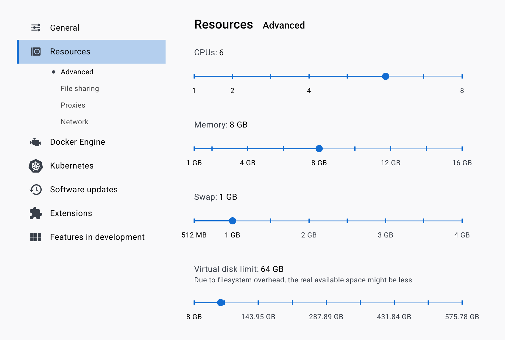

[](https://www.npmjs.com/package/@hashgraph/hedera-local)

The Hedera Local Node project allows developers to set up their own local network. The local network is composed of one mirror node and one consensus node. You can set this up by either using the CLI tool or by running Docker.

Note: This currently does not map to the latest mirror node version or mainnet consensus node version. An [issue](https://github.com/hashgraph/hedera-local-node/issues/28) has been opened to address this.

 - [Docker](#docker)
 - [CLI Tool](#cli-tool)

# Docker

## Requirements

- [Node.js](https://nodejs.org/) `>= v14.x` and `<= v16.x`
    - Node version check: `node -v`
- NPM `>= v6.14.17` and `<= v8.5.0`
    - NPM version check: `npm -v`
- [Docker](https://www.docker.com/) `>= v20.10.x`
    - Docker version check: `docker -v`
- [Docker Compose](https://docs.docker.com/compose/) `=> v1.28.0 && <= 1.29.2`
     - Docker Compose version check: `docker-compose -v`

### Note:

- Ensure to use Docker Compose version 1.29.2 on macOS, due to known bug in Docker Compose V2.
- Ensure the `gRPC FUSE for file sharing` and `Use Docker Compose V2` settings are disabled in the docker settings.

Note: The image may look different if you are on a different version


- Ensure the following configurations are set at minimum in Docker **Settings** -> **Resources** and are available for use
    - **CPUs:** 6
    - **Memory:** 5GB
    - **Swap:** 1 GB
    - **Disk Image Size:** 59.6 GB

Note: The image may look different if you are on a different version


## Start Your Local Network

1. Clone the `hedera-local-node` repo
```bash
git clone https://github.com/hashgraph/hedera-local-node.git
```
2. CD to the hedera-local-node directory
```bash
    cd hedera-local-node
```
3. Run `docker-compose up -d` from the terminal to get the network up and running
4. Set-up your local network client by following this [tutorial](https://docs.hedera.com/guides/docs/sdks/set-up-your-local-network)

## Stop Your Local Network
1. Run `docker-compose down -v; git clean -xfd; git reset --hard` to stop and remove the containers, volumes and clean manuelly generated files. If you would like to keep any files created manuelly in the working directory please save them before executing this command.

## Network Variables
These are the local network variables to interact with the consensus and mirror node. 
- Consensus Node Endpoint
  -  `127.0.0.1:50211`
  -  The IP address and port of the local consensus node
- Consensus Node Account ID
  -  `0.0.3`
  -  The node account ID to submit transactions and queries to
- Mirror Node GRPC Endpoint
  - `127.0.0.1:5600`
  - The mirror node network to use
- Mirror Node REST API Endpoint
  -  `127.0.0.1:5551` 
  -  The endpoint to submit rest API requests to
- Account ID
  - `0.0.2`
  - The account ID to use to pay for transactions and queries
- Account Key
  - `302e020100300506032b65700422042091132178e72057a1d7528025956fe39b0b847f200ab59b2fdd367017f3087137`
  -  The private key to account 0.0.2 to sign transactions and queries with

## Folder set up
1. `compose-network` folder has the static files needed for starting Local network.
2. `network-logs` folder will be created at runtime and will have all the log files generated after starting local node.

## Steps to change the memory limits and properties
The following environment variables can be changed in the `.env` file for various memory limits
1. Platform
    - PLATFORM_JAVA_HEAP_MIN
    - PLATFORM_JAVA_HEAP_MAX
2. Consensus node
    - NETWORK_NODE_MEM_LIMIT
3. Mirror node
    - MIRROR_GRPC_MEM_LIMIT - memory limit for mirror node gRPC
    - MIRROR_IMPORTER_MEM_LIMIT - memory limit for mirror node importer
    - MIRROR_REST_MEM_LIMIT - memory limit for mirror node rest api
    - MIRROR_WEB3_MEM_LIMIT - memory limit for mirror node web3
4. To change `application.properties`, `api-permission.properties` or `bootstrap.properties` properties, update the `APPLICATION_CONFIG_PATH` to the location of updated config folder in `.env` file

**IMPORTANT :** Ensure to do `docker-compose down -v; git clean -xfd; git reset --hard` and then `docker-compose up -d` for the new changes to take any effect.

&#10008; The keys under `network-node` (`hedera.key`, `hedera.crt` and the `keys` folder) are only intended to be used for testing with this docker based local network. These keys should not be used with any other networks.


# CLI Tool

# @hashgraph/hedera-local

## What

This package defines a basic cli commands, that can be executed via node (npx), for interacting with the Local Hedera
Network.

Exposed urls are:
```bash
Consensus Node Url - 127.0.0.1:50211
Node Id - 0.0.3
Mirror Node Url - http://127.0.0.1:5551
```

## Installation

#### Official NPM Release
The command below can be used to install the official release from the NPM repository. This version may not reflect
the most recent changes to the `main` branch of this repository. 

This version uses a baked in version of the Docker Compose definitions and will not reflect any local changes made to 
the repository. 

```bash
npm install --save-dev @hashgraph/hedera-local
```

#### Local Module
The command below can be used to install the `hedera-local` module as a symlink against your locally checked out copy of 
this repository.

This is the recommended method for testing against the latest changes or a point in time version from a branch/tag. 

```bash
npm install && npm install -g
```

## Using hedera-local

```
$ npx hedera-local

Local Hedera Package - Runs consensus and mirror nodes on localhost:
- consensus node url - 127.0.0.1:50211
- node id - 0.0.3
- mirror node url - http://127.0.0.1:5551

Available commands:
    start - Starts the local hedera network.
    stop - Stops the local hedera network and delete all the existing data.
    restart - Restart the local hedera network.
    generate-accounts <n> - Generates N accounts, default 10. 
```

Note: Generated accounts are 3 types. All of them are usable via HederaSDK or @hashgraph/hethers. Only Alias ECDSA accounts can be imported into wallet like Metamask or used in ethers.

### Commands

Note: There are known issues with this command. Please see issue [#43](https://github.com/hashgraph/hedera-local-node/issues/43) and issue [#33](https://github.com/hashgraph/hedera-local-node/issues/32).

#### `npx hedera-local start <options>`

```bash
$ npx hedera-local start
Starting the docker images...
Generating accounts...
|------------------------------------------------------------------------------------------|
|------------------------------| Accounts list (ECDSA keys) |------------------------------|
|    id    |                            private key                             |  balance |
|------------------------------------------------------------------------------------------|
| 0.0.1002 - 0x7f109a9e3b0d8ecfba9cc23a3614433ce0fa7ddcc80f2a8f10b222179a5a80d6 - 100000 ℏ |
| 0.0.1003 - 0x6ec1f2e7d126a74a1d2ff9e1c5d90b92378c725e506651ff8bb8616a5c724628 - 100000 ℏ |
| 0.0.1004 - 0xb4d7f7e82f61d81c95985771b8abf518f9328d019c36849d4214b5f995d13814 - 100000 ℏ |
| 0.0.1005 - 0x941536648ac10d5734973e94df413c17809d6cc5e24cd11e947e685acfbd12ae - 100000 ℏ |
| 0.0.1006 - 0x5829cf333ef66b6bdd34950f096cb24e06ef041c5f63e577b4f3362309125863 - 100000 ℏ |
| 0.0.1007 - 0x8fc4bffe2b40b2b7db7fd937736c4575a0925511d7a0a2dfc3274e8c17b41d20 - 100000 ℏ |
| 0.0.1008 - 0xb6c10e2baaeba1fa4a8b73644db4f28f4bf0912cceb6e8959f73bb423c33bd84 - 100000 ℏ |
| 0.0.1009 - 0xfe8875acb38f684b2025d5472445b8e4745705a9e7adc9b0485a05df790df700 - 100000 ℏ |
| 0.0.1010 - 0xbdc6e0a69f2921a78e9af930111334a41d3fab44653c8de0775572c526feea2d - 100000 ℏ |
| 0.0.1011 - 0x3e215c3d2a59626a669ed04ec1700f36c05c9b216e592f58bbfd3d8aa6ea25f9 - 100000 ℏ |
|------------------------------------------------------------------------------------------|

|--------------------------------------------------------------------------------------------------------------------------------------|
|--------------------------------------------------| Accounts list (Alias ECDSA keys) |------------------------------------------------|
|    id    |                  address                   |                             private key                            | balance |
|--------------------------------------------------------------------------------------------------------------------------------------|
| 0.0.1012 - 0x67D8d32E9Bf1a9968a5ff53B87d777Aa8EBBEe69 - 0x105d050185ccb907fba04dd92d8de9e32c18305e097ab41dadda21489a211524 - 10000 ℏ |
| 0.0.1013 - 0x05FbA803Be258049A27B820088bab1cAD2058871 - 0x2e1d968b041d84dd120a5860cee60cd83f9374ef527ca86996317ada3d0d03e7 - 10000 ℏ |
| 0.0.1014 - 0x927E41Ff8307835A1C081e0d7fD250625F2D4D0E - 0x45a5a7108a18dd5013cf2d5857a28144beadc9c70b3bdbd914e38df4e804b8d8 - 10000 ℏ |
| 0.0.1015 - 0xc37f417fA09933335240FCA72DD257BFBdE9C275 - 0x6e9d61a325be3f6675cf8b7676c70e4a004d2308e3e182370a41f5653d52c6bd - 10000 ℏ |
| 0.0.1016 - 0xD927017F5a6a7A92458b81468Dc71FCE6115B325 - 0x0b58b1bd44469ac9f813b5aeaf6213ddaea26720f0b2f133d08b6f234130a64f - 10000 ℏ |
| 0.0.1017 - 0x5C41A21F14cFe9808cBEc1d91b55Ba75ed327Eb6 - 0x95eac372e0f0df3b43740fa780e62458b2d2cc32d6a440877f1cc2a9ad0c35cc - 10000 ℏ |
| 0.0.1018 - 0xcdaD5844f865F379beA057fb435AEfeF38361B68 - 0x6c6e6727b40c8d4b616ab0d26af357af09337299f09c66704146e14236972106 - 10000 ℏ |
| 0.0.1019 - 0x6e5D3858f53FC66727188690946631bDE0466B1A - 0x5072e7aa1b03f531b4731a32a021f6a5d20d5ddc4e55acbb71ae202fc6f3a26d - 10000 ℏ |
| 0.0.1020 - 0x29cbb51A44fd332c14180b4D471FBBc6654b1657 - 0x60fe891f13824a2c1da20fb6a14e28fa353421191069ba6b6d09dd6c29b90eff - 10000 ℏ |
| 0.0.1021 - 0x17b2B8c63Fa35402088640e426c6709A254c7fFb - 0xeae4e00ece872dd14fb6dc7a04f390563c7d69d16326f2a703ec8e0934060cc7 - 10000 ℏ |
|--------------------------------------------------------------------------------------------------------------------------------------|

|------------------------------------------------------------------------------------------|
|-----------------------------| Accounts list (ED25519 keys) |-----------------------------|
|    id    |                            private key                             |  balance |
|------------------------------------------------------------------------------------------|
| 0.0.1022 - 0xa608e2130a0a3cb34f86e757303c862bee353d9ab77ba4387ec084f881d420d4 - 100000 ℏ |
| 0.0.1023 - 0xbbd0894de0b4ecfa862e963825c5448d2d17f807a16869526bff29185747acdb - 100000 ℏ |
| 0.0.1024 - 0x8fd50f886a2e7ed499e7686efd1436b50aa9b64b26e4ecc4e58ca26e6257b67d - 100000 ℏ |
| 0.0.1025 - 0x62c966ebd9dcc0fc16a553b2ef5b72d1dca05cdf5a181027e761171e9e947420 - 100000 ℏ |
| 0.0.1026 - 0x805c9f422fd9a768fdd8c68f4fe0c3d4a93af714ed147ab6aed5f0ee8e9ee165 - 100000 ℏ |
| 0.0.1027 - 0xabfdb8bf0b46c0da5da8d764316f27f185af32357689f7e19cb9ec3e0f590775 - 100000 ℏ |
| 0.0.1028 - 0xec299c9f17bb8bdd5f3a21f1c2bffb3ac86c22e84c325e92139813639c9c3507 - 100000 ℏ |
| 0.0.1029 - 0xcb833706d1df537f59c418a00e36159f67ce3760ce6bf661f11f6da2b11c2c5a - 100000 ℏ |
| 0.0.1030 - 0x9b6adacefbbecff03e4359098d084a3af8039ce7f29d95ed28c7ebdb83740c83 - 100000 ℏ |
| 0.0.1031 - 0x9a07bbdbb62e24686d2a4259dc88e38438e2c7a1ba167b147ad30ac540b0a3cd - 100000 ℏ |
|------------------------------------------------------------------------------------------|
```

- --accounts - Default is 10 per type. Specify the number of accounts to generate at startup. The first 10 are with predefined
  private keys, and the next ones are with random generated private keys.

```bash
$ npx hedera-local start --accounts=2
Starting the docker images...
Generating accounts...
|------------------------------------------------------------------------------------------|
|------------------------------| Accounts list (ECDSA keys) |------------------------------|
|    id    |                            private key                             |  balance |
|------------------------------------------------------------------------------------------|
| 0.0.1002 - 0x7f109a9e3b0d8ecfba9cc23a3614433ce0fa7ddcc80f2a8f10b222179a5a80d6 - 100000 ℏ |
| 0.0.1003 - 0x6ec1f2e7d126a74a1d2ff9e1c5d90b92378c725e506651ff8bb8616a5c724628 - 100000 ℏ |
|------------------------------------------------------------------------------------------|

|--------------------------------------------------------------------------------------------------------------------------------------|
|--------------------------------------------------| Accounts list (Alias ECDSA keys) |------------------------------------------------|
|    id    |                  address                   |                             private key                            | balance |
|--------------------------------------------------------------------------------------------------------------------------------------|
| 0.0.1004 - 0x67D8d32E9Bf1a9968a5ff53B87d777Aa8EBBEe69 - 0x105d050185ccb907fba04dd92d8de9e32c18305e097ab41dadda21489a211524 - 10000 ℏ |
| 0.0.1005 - 0x05FbA803Be258049A27B820088bab1cAD2058871 - 0x2e1d968b041d84dd120a5860cee60cd83f9374ef527ca86996317ada3d0d03e7 - 10000 ℏ |
|--------------------------------------------------------------------------------------------------------------------------------------|

|------------------------------------------------------------------------------------------|
|-----------------------------| Accounts list (ED25519 keys) |-----------------------------|
|    id    |                            private key                             |  balance |
|------------------------------------------------------------------------------------------|
| 0.0.1006 - 0xa608e2130a0a3cb34f86e757303c862bee353d9ab77ba4387ec084f881d420d4 - 100000 ℏ |
| 0.0.1007 - 0xbbd0894de0b4ecfa862e963825c5448d2d17f807a16869526bff29185747acdb - 100000 ℏ |
|------------------------------------------------------------------------------------------|
```

---

#### `npx hedera-local stop`

```bash
$ npx hedera-local stop
Stopping the docker images...
Cleaning the volumes and temp files...
```

No available options

---

#### `npx hedera-local restart <options>`

```bash
$ npx hedera-local restart
Stopping the docker images...
Cleaning the volumes and temp files...
Starting the docker images...
Generating accounts...
|------------------------------------------------------------------------------------------|
|------------------------------| Accounts list (ECDSA keys) |------------------------------|
|    id    |                            private key                             |  balance |
|------------------------------------------------------------------------------------------|
| 0.0.1002 - 0x7f109a9e3b0d8ecfba9cc23a3614433ce0fa7ddcc80f2a8f10b222179a5a80d6 - 100000 ℏ |
| 0.0.1003 - 0x6ec1f2e7d126a74a1d2ff9e1c5d90b92378c725e506651ff8bb8616a5c724628 - 100000 ℏ |
| 0.0.1004 - 0xb4d7f7e82f61d81c95985771b8abf518f9328d019c36849d4214b5f995d13814 - 100000 ℏ |
| 0.0.1005 - 0x941536648ac10d5734973e94df413c17809d6cc5e24cd11e947e685acfbd12ae - 100000 ℏ |
| 0.0.1006 - 0x5829cf333ef66b6bdd34950f096cb24e06ef041c5f63e577b4f3362309125863 - 100000 ℏ |
| 0.0.1007 - 0x8fc4bffe2b40b2b7db7fd937736c4575a0925511d7a0a2dfc3274e8c17b41d20 - 100000 ℏ |
| 0.0.1008 - 0xb6c10e2baaeba1fa4a8b73644db4f28f4bf0912cceb6e8959f73bb423c33bd84 - 100000 ℏ |
| 0.0.1009 - 0xfe8875acb38f684b2025d5472445b8e4745705a9e7adc9b0485a05df790df700 - 100000 ℏ |
| 0.0.1010 - 0xbdc6e0a69f2921a78e9af930111334a41d3fab44653c8de0775572c526feea2d - 100000 ℏ |
| 0.0.1011 - 0x3e215c3d2a59626a669ed04ec1700f36c05c9b216e592f58bbfd3d8aa6ea25f9 - 100000 ℏ |
|------------------------------------------------------------------------------------------|

|--------------------------------------------------------------------------------------------------------------------------------------|
|--------------------------------------------------| Accounts list (Alias ECDSA keys) |------------------------------------------------|
|    id    |                  address                   |                             private key                            | balance |
|--------------------------------------------------------------------------------------------------------------------------------------|
| 0.0.1012 - 0x67D8d32E9Bf1a9968a5ff53B87d777Aa8EBBEe69 - 0x105d050185ccb907fba04dd92d8de9e32c18305e097ab41dadda21489a211524 - 10000 ℏ |
| 0.0.1013 - 0x05FbA803Be258049A27B820088bab1cAD2058871 - 0x2e1d968b041d84dd120a5860cee60cd83f9374ef527ca86996317ada3d0d03e7 - 10000 ℏ |
| 0.0.1014 - 0x927E41Ff8307835A1C081e0d7fD250625F2D4D0E - 0x45a5a7108a18dd5013cf2d5857a28144beadc9c70b3bdbd914e38df4e804b8d8 - 10000 ℏ |
| 0.0.1015 - 0xc37f417fA09933335240FCA72DD257BFBdE9C275 - 0x6e9d61a325be3f6675cf8b7676c70e4a004d2308e3e182370a41f5653d52c6bd - 10000 ℏ |
| 0.0.1016 - 0xD927017F5a6a7A92458b81468Dc71FCE6115B325 - 0x0b58b1bd44469ac9f813b5aeaf6213ddaea26720f0b2f133d08b6f234130a64f - 10000 ℏ |
| 0.0.1017 - 0x5C41A21F14cFe9808cBEc1d91b55Ba75ed327Eb6 - 0x95eac372e0f0df3b43740fa780e62458b2d2cc32d6a440877f1cc2a9ad0c35cc - 10000 ℏ |
| 0.0.1018 - 0xcdaD5844f865F379beA057fb435AEfeF38361B68 - 0x6c6e6727b40c8d4b616ab0d26af357af09337299f09c66704146e14236972106 - 10000 ℏ |
| 0.0.1019 - 0x6e5D3858f53FC66727188690946631bDE0466B1A - 0x5072e7aa1b03f531b4731a32a021f6a5d20d5ddc4e55acbb71ae202fc6f3a26d - 10000 ℏ |
| 0.0.1020 - 0x29cbb51A44fd332c14180b4D471FBBc6654b1657 - 0x60fe891f13824a2c1da20fb6a14e28fa353421191069ba6b6d09dd6c29b90eff - 10000 ℏ |
| 0.0.1021 - 0x17b2B8c63Fa35402088640e426c6709A254c7fFb - 0xeae4e00ece872dd14fb6dc7a04f390563c7d69d16326f2a703ec8e0934060cc7 - 10000 ℏ |
|--------------------------------------------------------------------------------------------------------------------------------------|

|------------------------------------------------------------------------------------------|
|-----------------------------| Accounts list (ED25519 keys) |-----------------------------|
|    id    |                            private key                             |  balance |
|------------------------------------------------------------------------------------------|
| 0.0.1022 - 0xa608e2130a0a3cb34f86e757303c862bee353d9ab77ba4387ec084f881d420d4 - 100000 ℏ |
| 0.0.1023 - 0xbbd0894de0b4ecfa862e963825c5448d2d17f807a16869526bff29185747acdb - 100000 ℏ |
| 0.0.1024 - 0x8fd50f886a2e7ed499e7686efd1436b50aa9b64b26e4ecc4e58ca26e6257b67d - 100000 ℏ |
| 0.0.1025 - 0x62c966ebd9dcc0fc16a553b2ef5b72d1dca05cdf5a181027e761171e9e947420 - 100000 ℏ |
| 0.0.1026 - 0x805c9f422fd9a768fdd8c68f4fe0c3d4a93af714ed147ab6aed5f0ee8e9ee165 - 100000 ℏ |
| 0.0.1027 - 0xabfdb8bf0b46c0da5da8d764316f27f185af32357689f7e19cb9ec3e0f590775 - 100000 ℏ |
| 0.0.1028 - 0xec299c9f17bb8bdd5f3a21f1c2bffb3ac86c22e84c325e92139813639c9c3507 - 100000 ℏ |
| 0.0.1029 - 0xcb833706d1df537f59c418a00e36159f67ce3760ce6bf661f11f6da2b11c2c5a - 100000 ℏ |
| 0.0.1030 - 0x9b6adacefbbecff03e4359098d084a3af8039ce7f29d95ed28c7ebdb83740c83 - 100000 ℏ |
| 0.0.1031 - 0x9a07bbdbb62e24686d2a4259dc88e38438e2c7a1ba167b147ad30ac540b0a3cd - 100000 ℏ |
|------------------------------------------------------------------------------------------|
```

- --accounts - Default is 10. Specify the number of accounts to generate at startup. The first 10 are with predefined
  private keys, and the next ones are with random generated private keys.

```bash
$ npx hedera-local restart --accounts=2
Stopping the docker images...
Cleaning the volumes and temp files...
Starting the docker images...
Generating accounts...
|------------------------------------------------------------------------------------------|
|------------------------------| Accounts list (ECDSA keys) |------------------------------|
|    id    |                            private key                             |  balance |
|------------------------------------------------------------------------------------------|
| 0.0.1002 - 0x7f109a9e3b0d8ecfba9cc23a3614433ce0fa7ddcc80f2a8f10b222179a5a80d6 - 100000 ℏ |
| 0.0.1003 - 0x6ec1f2e7d126a74a1d2ff9e1c5d90b92378c725e506651ff8bb8616a5c724628 - 100000 ℏ |
|------------------------------------------------------------------------------------------|

|--------------------------------------------------------------------------------------------------------------------------------------|
|--------------------------------------------------| Accounts list (Alias ECDSA keys) |------------------------------------------------|
|    id    |                  address                   |                             private key                            | balance |
|--------------------------------------------------------------------------------------------------------------------------------------|
| 0.0.1004 - 0x67D8d32E9Bf1a9968a5ff53B87d777Aa8EBBEe69 - 0x105d050185ccb907fba04dd92d8de9e32c18305e097ab41dadda21489a211524 - 10000 ℏ |
| 0.0.1005 - 0x05FbA803Be258049A27B820088bab1cAD2058871 - 0x2e1d968b041d84dd120a5860cee60cd83f9374ef527ca86996317ada3d0d03e7 - 10000 ℏ |
|--------------------------------------------------------------------------------------------------------------------------------------|

|------------------------------------------------------------------------------------------|
|-----------------------------| Accounts list (ED25519 keys) |-----------------------------|
|    id    |                            private key                             |  balance |
|------------------------------------------------------------------------------------------|
| 0.0.1006 - 0xa608e2130a0a3cb34f86e757303c862bee353d9ab77ba4387ec084f881d420d4 - 100000 ℏ |
| 0.0.1007 - 0xbbd0894de0b4ecfa862e963825c5448d2d17f807a16869526bff29185747acdb - 100000 ℏ |
|------------------------------------------------------------------------------------------|
```

---

#### `npx hedera-local generate-accounts <num>`

```bash
$ npx hedera-local generate-accounts 2
|------------------------------------------------------------------------------------------|
|------------------------------| Accounts list (ECDSA keys) |------------------------------|
|    id    |                            private key                             |  balance |
|------------------------------------------------------------------------------------------|
| 0.0.1008 - 0x626404782c00c1b6b865a43a8de0680296951564fd6c3b3945e04383d24e3c52 - 100000 ℏ |
| 0.0.1009 - 0x227641ce4807f719560627825d9799135e849689eb1c863add1682161970efd6 - 100000 ℏ |
|------------------------------------------------------------------------------------------|

|--------------------------------------------------------------------------------------------------------------------------------------|
|--------------------------------------------------| Accounts list (Alias ECDSA keys) |------------------------------------------------|
|    id    |                  address                   |                             private key                            | balance |
|--------------------------------------------------------------------------------------------------------------------------------------|
| 0.0.1010 - 0xeBaea5B3BB2f7C96C035804C7913eC79593f3097 - 0xa44cbbd0d48c6b534fc7b243b267bae73f5843df71c73628c9883ff20c660b04 - 10000 ℏ |
| 0.0.1011 - 0x58a2452e618586c439325d549Ef9d1549e3c7A26 - 0x79a9bcb39994373774c06bb0a5e8289ffe8f8a734e2c01e32186196fb68abccf - 10000 ℏ |
|--------------------------------------------------------------------------------------------------------------------------------------|

|------------------------------------------------------------------------------------------|
|-----------------------------| Accounts list (ED25519 keys) |-----------------------------|
|    id    |                            private key                             |  balance |
|------------------------------------------------------------------------------------------|
| 0.0.1012 - 0x5f608a35c956fbb1d932c0f3fc113d308041a595351adeddf4e93cee59c1b978 - 100000 ℏ |
| 0.0.1013 - 0x3fcd5855969a881dcaad4446101a3241ccb5d6e7237f3a55b19268bfcbfdfa91 - 100000 ℏ |
|------------------------------------------------------------------------------------------|
```

No available options

---

#### You can use it in a hardhat project alongside with [Hardhat Hethers Plugin](https://github.com/LimeChain/hardhat-hethers) by adding the following config:
```bash
defaultNetwork: "localHederaNetwork",
hedera: {
  gasLimit: 300000,
  networks: {
    localHederaNetwork: {
      consensusNodes: [
        {
          url: '127.0.0.1:50211',
          nodeId: '0.0.3'
        }
      ],
      mirrorNodeUrl: 'http://127.0.0.1:5551',
      chainId: 0,
      accounts: [
        {
          "account": '0.0.1001',
          "privateKey": '0x7f109a9e3b0d8ecfba9cc23a3614433ce0fa7ddcc80f2a8f10b222179a5a80d6'
        },
        {
          "account": '0.0.1002',
          "privateKey": '0x6ec1f2e7d126a74a1d2ff9e1c5d90b92378c725e506651ff8bb8616a5c724628'
        },
        {
          "account": '0.0.1003',
          "privateKey": '0xb4d7f7e82f61d81c95985771b8abf518f9328d019c36849d4214b5f995d13814'
        },
        {
          "account": '0.0.1004',
          "privateKey": '0x941536648ac10d5734973e94df413c17809d6cc5e24cd11e947e685acfbd12ae'
        },
        {
          "account": '0.0.1005',
          "privateKey": '0x5829cf333ef66b6bdd34950f096cb24e06ef041c5f63e577b4f3362309125863'
        }
      ]
    }
  }
}
```

---


## Support
If you have a question on how to use the product, please see our [support guide](https://github.com/hashgraph/.github/blob/main/SUPPORT.md).

## Contributing
Contributions are welcome. Please see the [contributing guide](https://github.com/hashgraph/.github/blob/main/CONTRIBUTING.md) to see how you can get involved.

## Code of Conduct
This project is governed by the [Contributor Covenant Code of Conduct](https://github.com/hashgraph/.github/blob/main/CODE_OF_CONDUCT.md). By participating, you are expected to uphold this code of conduct. Please report unacceptable behavior to oss@hedera.com.

## License
[Apache License 2.0](https://github.com/hashgraph/hedera-json-rpc-relay/blob/main/LICENSE)
