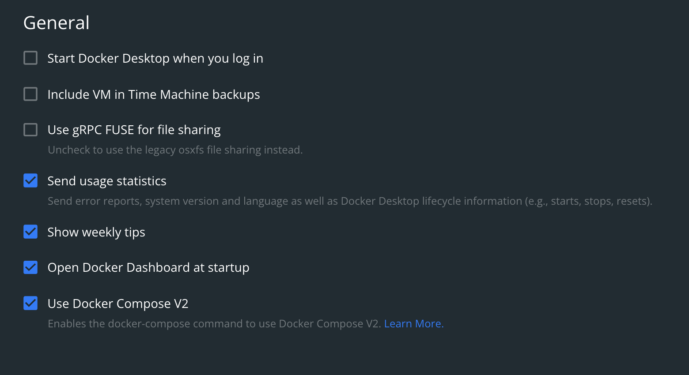

# How to run a local node with a mirror node and consensus node

### Setup

1. Clone this repository.
2. Run `docker-compose up -d` from the console.
3. After the run do `docker-compose down -v; git clean -xfd; git reset --hard` to stop and remove the containers, volumes and clean generated files.

### Folder set up
1. `compose-network` folder has the static files needed for starting Local network.
2. `network-logs` folder will be created at runtime and will have all the log files generated after starting local node.

### NOTE
1. Ensure to use Docker Compose version 1.29.2 on macOS, due to known bug in Docker Compose V2. 
2. Ensure the `gRPC FUSE for file sharing` and `Use Docker Compose V2` settings are disabled in the docker settings.

