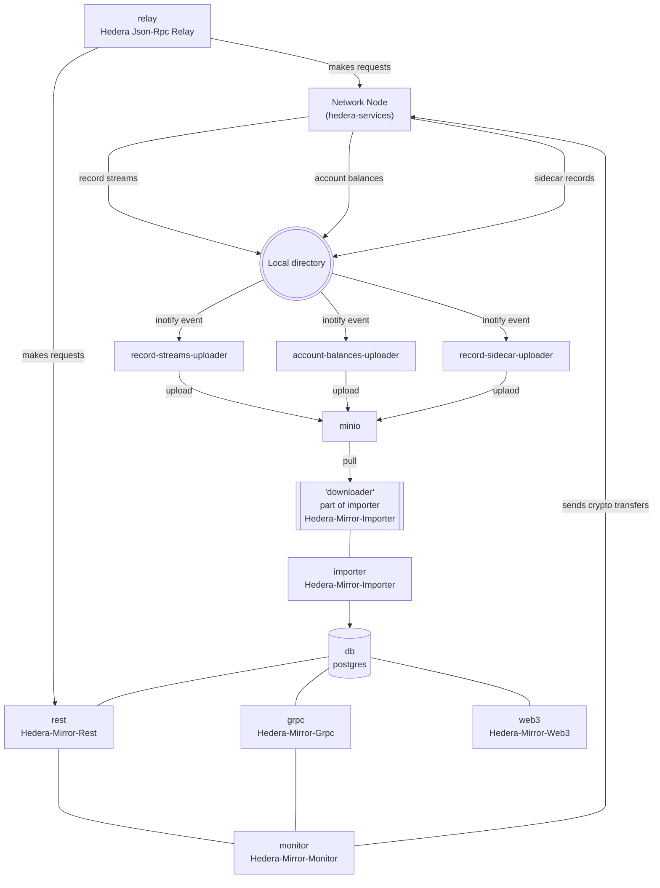
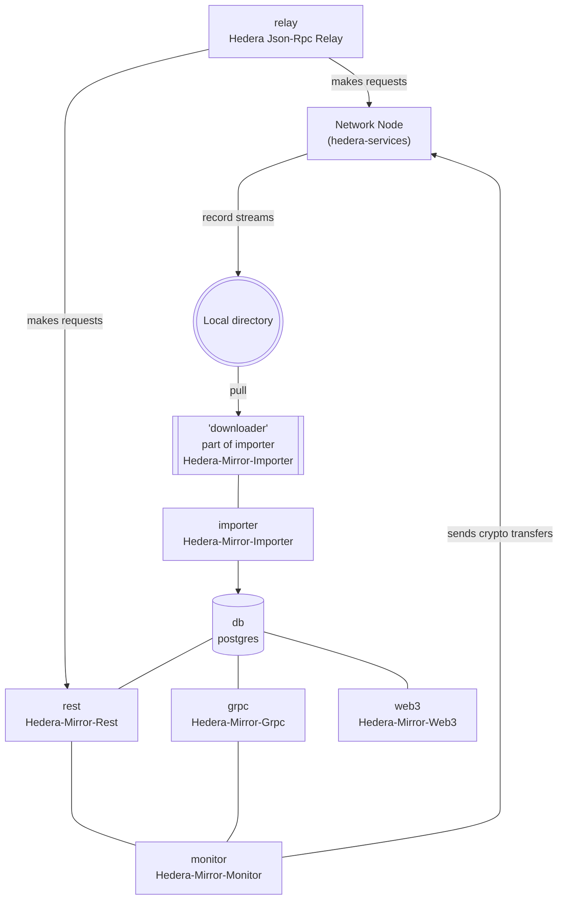

# Summary

Currently Local Node supports optimized evm mode for better developer experience. Purpose of this is to allow for faster node startup, faster transactions, which allows for faster testing.
  

# Modes

## Full Mode

This mode support full local node experience. Same as mainnet, testnet and previewnet. This includes all the components of a production network - network node, mirror node, minio and uploaders.
 
Note: This is optional startup mode for local-node. Can be turned on by passing following options at startup `--full` or `--full=true`.
  

## Turbo Mode

This mode enables faster local node experience. It differs from other production environment by turning off and working around couple of components. We are using fewer docker containers responsible for handling export and import of record files, by bypassing them and saving the files directly to the disk. This saves time because we don't need to export the files to minio component and import them from there.
 
Note: This is the default startup mode for local-node. Can be turned off by passing following options at startup `--full` or `--full=true`.
  

# Diagrams

## Full mode diagram

  

## Turbo mode diagram

