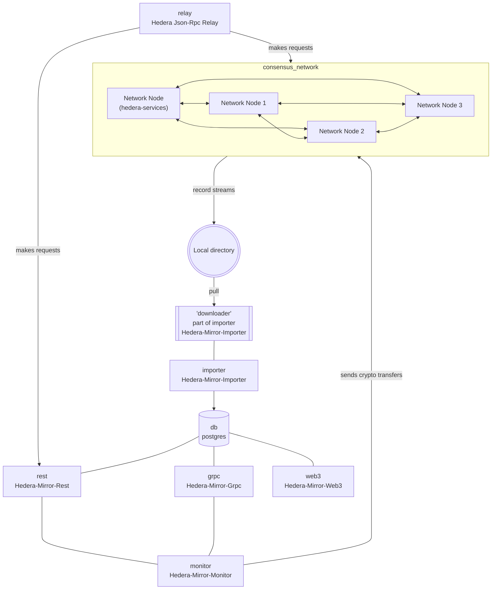

# Summary

Local Node's default mode is the single node mode. In addition to that it also supports multinode mode `--multinode`.

You can invoke it for such cases as:
- testing more complex use-cases
- different scenarios with healthy/unhealthy nodes
- node catchup when going out of sync.

In this mode multiple instances of the Hedera network node are run on the same machine. A decentralized setup where each node runs on a separate machine is **not** supported by Local Node.  
Generally speaking multinode mode is an advanced mode, that should be used only for specific use cases that require multiple consensus nodes. Due to its increased resource requirements and complexity it is not recommended for day to day use.
<br><br>

# Requirements

Running Local Node in multinode mode requires more resources and has a bigger memory footprint than running in single-node mode. Ensure that local node works properly in the default single node mode, before trying to run it in multinode. To run the multinode mode it's required that at least 14 GB of memory are available to Docker.  
 If using Docker Desktop some changes to its settings need to be made.

### Note:

- Ensure the following configurations are set at minimum in Docker **Settings** -> **Resources** and are available for use
  - **CPUs:** 6
  - **Memory:** 14 GB
  - **Swap:** 1 GB
  - **Disk Image Size:** 64 GB

# Using Multinode mode
To start Hedera Local Node in multinode mode use the `--multinode` flag togerther with your start command, for example.

```bash
hedera start -d --multinode
```
You can confirm that multinode mode has been started sucessfully, by checking either the output of `docker ps --format "table {{.Names}}" | grep network` or your Docker Desktop dashboard.  
You should see 4 nodes runnning
```
network-node
network-node-1
network-node-2
network-node-3
```

## Stopping/Starting nodes
You can start or stop individual nodes to test different aspects of consensus, sync and node selection logic or for whatever use case you need by utilizing standard docker management commands.  
For example:
```bash
# To stop an individual node you can use
docker stop network-node-3
# To start it back 
docker start network-node-3
# You can check logs of the individual node by calling
docker logs network-node-3 -f
```

In mutlinode mode you need at least 3 healthy nodes for operational network.

# Full and Turbo Modes

When running the Local Node in mutlinode mode both **Full Mode** `--full` and **Turbo Mode** are supported. When running in full mode each node's record stream files are uploaded to its own directory in the `minio` bucket by the correpsonding uploader containers (`record-streams-uploader-N`, `account-balances-uploader-N`,`record-sidecar-uploader-N`). When running in turbo mode (the default) they are read from the corresponding local directory.

# Diagram


## Multinode mode diagram


